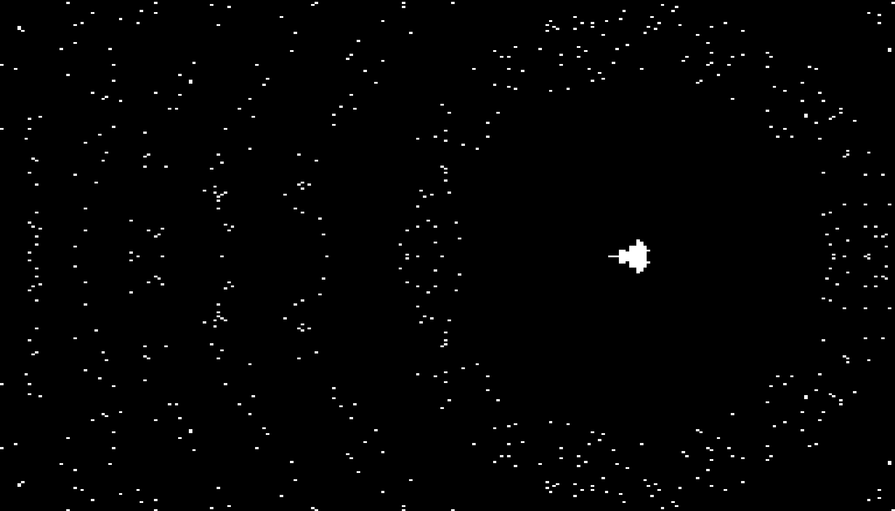

+++
title = "Growing an Open-Source Hardware Infrastructure"
date = 2021-07-15
draft = false
+++

John Hennessy and David Patterson's Turing lecture proclaimed that a new
golden age of computer architecture is upon us---one where specialized hardware
accelerators will become ubiquitous and replace general-purpose architectures
for the most computationally demanding tasks.

There is however, one small problem: designing hardware is hard, especially
if you come from a software background.
Hardware design languages operate with the low-level abstractions of gates,
wires, and clocks cycles and rely on proprietary, vendor-locked toolchains to
accomplish anything.
While this *may* be acceptable for people designing state of the art processor
chips, it is clearly untenable in the golden age of computer architecture where
rapid iteration of hardware is going to be key.

Our group at the Cornell believes that hardware design should be easy---instead
of needing person-years of work to develop a simple accelerator, building one
should be a simple weekend job.
This vision mirrors the progression of software development---deploying a new
website, service, or app is something software engineers consider to be boring,
simple tasks that take a few line of python to accomplish.
Hardware design should be the same.

The first step towards this goal is designing new, high-level languages that
abstract over the low-level details of hardware design and help programmers
iterate on hardware accelerators quickly.
We think that rapid innovation in language design is key for unlocking the true
potential of hardware accelerators in the future.
To further this goal, we've been building Calyx, a compiler infrastructure and
ecosystem that supports new high-level languages for designing hardware
accelerators.
The equivalent of Calyx in the software world would be the LLVM compiler
infrastructure that handles the "boring" aspects of building a language:
optimization, debugging, testing, etc.

Calyx aims to be the LLVM of [accelerator design languages][adl] and make it
easier for researchers and practitioners to prototype new languages without
having to build all the tedious machinery required to build a "real" language.
This post is an overview of the infrastructure and ecosystem we're building
around Calyx.
It also celebrates roughly one year since the submission of the [original Calyx
paper][calyx-paper].

## Simplifying the Hardware Workflow

Hardware workflows are notoriously complicated, requiring invocation and
chaining of dozens of commands before you get anything working.
This problem is magnified when *compiling* high-level languages to hardware
design languages since you need invoke even more tools.
For example, here is the set of commands needed to simulate a hardware
design written in [Dahlia][] (a C-like accelerator design language) with
[Verilator][]:
```bash
# Generate Calyx IR from Dahlia
% dahlia/fuse -b calyx --lower -l error -o out.futil
# Generate Verilog from Calyx IR
% calyx/futil -b verilog out.futil -o out.sv
# Compile Verilog using Verilator
% verilator -cc --trace out.sv --exe testbench.cpp \
  --exe --build --top-module main
# Execute the generated Verilator code.
% ./Vmain   # Execute the Verilator model
```

Every time the original Dahlia file is changed, these commands need to be
re-run!
Now consider that Calyx currently supports five frontends like Dahlia and
four backends and the complexity of working with hardware toolchains becomes
self-evident.
Being an academic research group, this became a particular pain point for us
since on boarding new students to the project required weeks of background
learning about compilers, simulators, and funky CLI tools.

We set out to address this using [`fud`][fud], a python-based hardware
workflow manager.
`fud` is built around the idea of "stages" which provide a way for transforming
a set of input files (say a Dahlia source file) into output files (say a file
with Calyx IR).
`fud` can also chain sequences of stages to transform files several times.
For example, the following `fud` command runs all the necessary steps to
compile a Dahlia source file through Calyx and simulate it with Verilator:
```bash
% fud exec input.fuse --from dahlia --to dat \
      -s verilog.data inputs.json
```

When given this command, `fud` invokes the right compiler toolchains, marshals
input data to Verilator and generates output in a readable format.
`fud` also makes it trivial to switch between various frontends and backends.
For example, to simulate the same design with [Icarus Verilog][iverilog],
we simplify run the command:
```bash
% fud exec input.fuse --from dahlia --to dat \
      --through icarus-verilog -s verilog.data inputs.json
```

We've built `fud` so that extending it with new frontends and backends is easy:
you simply [write a python file][fud-external] that defines the stage
transformation and register it with `fud`.

## Calyx on Field-Programmable Gate Arrays (FPGAs)

Simulating a hardware design using software tools like [Verilator][] and making
them run on an FPGA are two very different challenges.
Running something on an FPGA requires generating the configuration files,
host code, and circuitry to interface the design with a CPU controller.
Over the last year, we've been working on an automated flow to run Calyx
programs on FPGAs.
This represents an exciting step in making Calyx a useful infrastructure for
accelerator design languages---developers can focus on building new languages
and Calyx will handle the tedious task of making things work on FPGAs.

<figure>

</img>
<figcaption>
Mandlebrot implementation in Calyx running on an FPGA.
</figcaption>
</figure>

In order to support Xilinx FPGAs, we implemented an AXI interface so that host
programs can communicate with kernels running on an FPGA.
We wrote a interface wrapper in Verilog that translates AXI commands into the `go/done`
style interface that Calyx components expect as well as copies memory into
local BRAMs that Calyx components can access them.

The Xilinx tools require several different metadata files alongside the Verilog
source.
We automated the creation of these files with `fud` to make interacting with
these tools more seamless.
The only piece of the puzzle that is manual at the moment is writing OpenCL
host code to integrate the kernel into an application.
While we are not looking to completely automate writing the host code, we would
like to write a generic host that understands the same data format we use for
simulation to enable easier validation.

While we are able to support the specific Xilinx boards, we do not yet have a
general solution.
A missing piece in the puzzle is a generic interface and intermediate
representation that can target arbitrary boards.
Thankfully, our collaborators at the University of Washington have been
developing [exactly this][reticle].

## New Frontends

Calyx's development as a language and an infrastructure is driven by frontends
that make use of it.
Since the publication of our paper, we have implemented two new frontends that
can be used to stress test Calyx.

### TVM Relay

[TVM][] is a compiler for machine learning frameworks that can optimize and
target kernels to several different backends.
Our TVM frontend compiles TVM's internal IR, called Relay, to Calyx IR, and
can successfully simulate small neural networks.
Relay instructions are quite high-level, implementing operators such as a
two-dimensional convolution.
In order to side-step manually generating such operators in Calyx and to
simplify debugging, we instead generate Dahlia programs to implement these
operators.

In [Calyx #504](https://github.com/cucapra/calyx/pull/504), we successfully
simulated a [LeNet][] network model.
Of course LeNet is an extremely simple neural network and our long-term goal
is to support modern networks.
Our next target is the [VGG][] network.
However, we've also realized while building this network that simple,
Verilator-based simulation is going to be too slow so we're also working
on other efforts like running Calyx on an FPGA and building a fast simulator
for Calyx itself.

### Number Theoretic Transform (NTT)

The number theoretic transform (NTT) is a generalization of the fast Fourier
transform, commonly used as a primitive in homomorphic cryptography.
We implemented an NTT pipeline generator produces the NTT transform of some
input with the provided bit width and input array size parameters.


## Calyx + CIRCT

[CIRCT][] (Circuit IR Compilers and Tools) is a cross-community effort to build
an open-source hardware ecosystem using the [MLIR][] framework.
The MLIR framework represents compilation as a series of transformations between
"dialects" or languages at different levels of abstractions.
In the long-term, the CIRCT community is interested in compiling high-level
languages to hardware designs, which is something Calyx can already do today.
In order to align our efforts, we've implemented a [Calyx
dialect][calyx-dialect] which can be emitted from other dialects in CIRCT,
transformed by the Calyx compiler, and of course, integrated with `fud`.

The CIRCT developers have also implemented a [lowering pass][scf-to-calyx] that
transforms programs in the [SCF dialect][scf], which represents parallel,
imperative, loop-based programs, to Calyx.
We're super excited about the future opportunities that this integration brings
and will be building tons of new features using it.
If you're excited about CIRCT and Calyx, you can start contributing to the
[issues][calyx-circt-issues].


## Calyx Interpreter

Another major infrastructure tool that's been under-development is a native
interpreter for Calyx. It might seem a bit strange to be working on an
interpreter given that Calyx already has a compiler; typically language
development starts with an interpreter and moves to a compiler later as they are
far more efficient. Nevertheless, a Calyx interpreter represents an exciting
development for the Calyx ecosystem allowing us to address many different
problems: from reducing simulation complexity to verifying compiler passes.

Currently, the primary way to quickly run Calyx code is by compiling it
to Verilog and using [Verilator][] to simulate it.
In process, however, we end up losing all of the control information represent
in the original Calyx program which can be used to optimize simulation.
We expect that by using the higher-level control information information in
the Calyx program, we can improve simulation speeds by an order of magnitude.

A common problem in circuit simulation is that a
large portion of the circuit is not running at any given time but still must be
simulated. There are many clever heuristics for identifying the dormant parts of
the design and saving time by not simulating them; however Calyx needs no such
heuristics. The control structure in Calyx code means that we know precisely
what parts of the design are running at any given moment and needn't waste time
simulating portions of the circuit which are known to be dormant.
Furthermore, Calyx IR itself has less simulation complexity than the RTL it
generates.
Since the information available at the IR level is more structured, the
simulation itself is free of the complex details that appear at the RTL layer.

A Calyx interpreter will let us develop a better debugging infrastructure
with support for traditional tools like breakpoints, pausing execution, and
dumping internal state.
Today, when designing debuggers for hardware, developers have to trade-off between
the fast but opaque simulation on FPGAs or slow but transparent simulation in
software simulation.
A Calyx interpreter represents the best of both worlds, enabling faster and
transparent execution.

As a final note, a simulator is also a boon both for the language itself and the
core compiler infrastructure. Being able to run Calyx programs directly means we
can perform differential testing on compiler passes and verify that the given
changes made by a pass are indeed semantic preserving with respect to the input
program. Plus, the act of making the interpreter itself is an excellent way of
"hardening" the semantics of the language as it requires making clear decisions
on corner cases obscured by the translation to Verilog.

---

If any of these directions excite you, or you're just interested in using
Calyx as a backend, please [reach out to us][calyx-gh-disc]! We'd love hear
from you.

[lenet]: https://en.wikipedia.org/wiki/LeNet
[vgg]: https://neurohive.io/en/popular-networks/vgg16/
[calyx-paper]: https://rachitnigam.com/files/pubs/calyx.pdf
[mlir]: https://mlir.llvm.org/
[circt]: https://github.com/llvm/circt
[calyx-dialect]: https://github.com/llvm/circt/tree/46ae6df8eb30c0404a0cc54f92a68a63ef643c89/test/Dialect/Calyx
[reticle]: https://github.com/vegaluisjose/reticle
[dahlia]: https://capra.cs.cornell.edu/dahlia/
[verilator]: https://www.veripool.org/verilator/
[tvm]: https://github.com/apache/tvm
[register-sharing]: https://github.com/cucapra/calyx/blob/master/calyx/src/passes/register_unsharing.rs
[register-sharing-pr]: https://github.com/cucapra/calyx/pull/511
[chisel-sim]: https://scottbeamer.net/pubs/beamer-dac2020.pdf
[calyx-gh-disc]: https://github.com/cucapra/calyx/discussions
[fud]: https://docs.calyxir.org/fud/index.html
[adl]: https://www.sigarch.org/hdl-to-adl/
[iverilog]: http://iverilog.icarus.com/
[fud-external]: https://docs.calyxir.org/fud/external.html
[scf-to-calyx]: https://github.com/llvm/circt/issues/1777
[scf]: https://mlir.llvm.org/docs/Dialects/SCFDialect/
[calyx-circt-issues]: https://github.com/llvm/circt/labels/Calyx

<!--
## Control-Directed Optimizations: Register Unsharing

Calyx's strength is in its ability to represent *both* the structure and the
control flow of a hardware accelerator.
Apart from simplifying the design of frontends, this also enables unique
new optimizations that we've termed control-directed hardware optimizations.
These optimizations are truly unique to Calyx---the compiler needs to have
both an understanding of the control flow and the structural representation
to implement them.

One such optimization is register unsharing.
Yes you read that right, *unsharing*. But please hold your ire for a moment, I
promise there is a method to my madness.
In compilers like LLVM (and Calyx), register allocation (or register
sharing) passes aim to reduce the usage of registers in a hardware design.
Owing to the multi-objective design space, certain hardware designs, such as
ones targeting FPGAs may want to do the opposite---use more registers in
order to simplify other circuitry.

Sharing reduces the resources a given design requires; however, it does so at
the cost of increasing the wiring complexity.
Each "shared" instance of a register requires a multiplexer (or a mux) to arbitrate
access to it.
Unsharing, in contrast, moves the trade-off in an opposite direction. It
increases the number of registers in a design but reduces the wiring
complexity by requiring fewer multiplexers.

There are no universally "correct" places on this trade-off curve. FPGAs have a
set amount of resources per block and so up to a certain point it can be better
to have more registers rather than more multiplexers while the opposite holds for
taping out a design.

The [optimization pass][register-sharing] itself uses a Calyx-specific version
of a reaching definitions analysis that accounts for Calyx's guarded
assignments.
The reaching definition can be used to calculate groups that "must-write" and
"may-read" to registers and use this information to rewrite groups to unshare
registers.
For more technical details about the implementation please take a look at the
[pull request][register-sharing-pr].
-->


